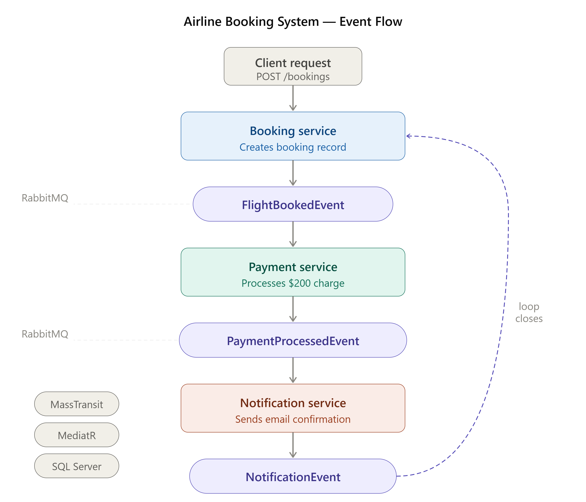

# ✈️ Airline Booking System

A microservices-based airline booking backend built with .NET — designed to practice distributed systems patterns, async messaging, and clean service boundaries.



## What is this?

This project simulates a real-world airline booking flow split across four independent services that communicate entirely through events — no direct HTTP calls between services. Once a booking is created, everything else (payment, notification, confirmation) happens automatically through the message bus.

## Services

| Service | Responsibility |
|---|---|
| **Booking** | Creates bookings and kicks off the whole flow |
| **Payment** | Processes payment after a booking is confirmed |
| **Notification** | Sends a notification after payment succeeds |
| **BuildingBlocks** | Shared contracts, events, and constants across services |

## Tech Stack

- **ASP.NET Core** — service hosts
- **MassTransit** — message bus abstraction
- **RabbitMQ** — message broker
- **MediatR** — in-process CQRS (commands/handlers per service)
- **Dapper + SQL Server** — data access
- **Docker** — runs RabbitMQ locally

## How the Flow Works

```
[Client] → Booking Service
              ↓ publishes FlightBookedEvent
         Payment Service
              ↓ publishes PaymentProcessedEvent
         Notification Service
              ↓ publishes NotificationEvent
         Booking Service (logs confirmation)
```

Each service only knows about the events it cares about — nothing more. The Booking service starts the chain and also closes it by consuming the final notification event.

### Event Queue Names

```
flight-booked-queue
payment-processed-queue
notification-sent-queue
```

## Project Structure

```
AirlineBookingSystem/
├── Bookings/
│   └── Application/
│       ├── Commands/
│       └── Consumers/          ← NotificationEventConsumer
├── Payments/
│   └── Application/
│       ├── Commands/
│       ├── Handlers/           ← ProcessPaymentHandler
│       └── Consumers/          ← FlightBookedConsumer
├── Notifications/
│   └── Application/
│       ├── Commands/
│       ├── Services/           ← NotificationService
│       └── Consumers/          ← PaymentProcessedConsumer
└── BuildingBlocks/
    └── Common/
        ├── EventBusConstant.cs
        └── Contracts/EventBus/Messages/
```


## What I Practiced Here

- Splitting a domain into bounded service contexts with no shared databases
- Event-driven choreography — services react to events instead of being called directly
- Using MassTransit to abstract away RabbitMQ plumbing
- Keeping each service's internal logic clean with MediatR commands and handlers
- Chaining async operations without coupling services to each other


# RabbitMQ — Cheatsheet

A personal reference for RabbitMQ concepts, from basics to advanced patterns.

## Table of Contents

1. [Core Concepts](#1-core-concepts)
2. [Exchanges in Depth](#2-exchanges-in-depth)
3. [Routing Keys & Bindings](#3-routing-keys--bindings)
4. [Durable Queues & Persistent Messages](#4-durable-queues--persistent-messages)
5. [Prefetch Count & BasicQos](#5-prefetch-count--basicqos)
6. [Competing Consumers & Work Queues](#6-competing-consumers--work-queues)
7. [Publish/Subscribe Pattern](#7-publishsubscribe-pattern)
8. [ACKs, NACKs & Publisher Confirms](#8-acks-nacks--publisher-confirms)
9. [Request/Reply Pattern (RPC)](#9-requestreply-pattern-rpc)
10. [Retry Strategies & Dead Letter Queues (DLQ)](#10-retry-strategies--dead-letter-queues-dlq)
11. [Delayed Messages (TTL + DLX or Delayed Exchange)](#11-delayed-messages-ttl--dlx-or-delayed-exchange)
12. [Idempotent Consumers](#12-idempotent-consumers)
13. [Outbox Pattern](#13-outbox-pattern)
14. [Inbox Pattern](#14-inbox-pattern)
15. [Saga Pattern](#15-saga-pattern)
16. [Event-Driven Architecture with RabbitMQ](#16-event-driven-architecture-with-rabbitmq)

---

## 1. Core Concepts

### Producer
A **Producer** is any application that sends messages. It never talks to a queue directly — it sends messages to an **Exchange**.

### Consumer
A **Consumer** is any application that reads messages from a queue. It subscribes to a queue and processes messages one by one (or in batches).

### Queue
A **Queue** is a buffer that stores messages until a consumer reads them. Queues are FIFO by default. Messages sit in the queue if no consumer is available.

### Exchange
An **Exchange** receives messages from producers and routes them to one or more queues based on rules. There are 4 types: Direct, Fanout, Topic, and Headers (covered in section 2).

### Routing Key
A **Routing Key** is a string the producer attaches to a message (like `order.created`). The Exchange uses it to decide which queue(s) to send the message to.

```
Producer → [Exchange] → (routing logic) → [Queue] → Consumer
```

---

## 2. Exchanges in Depth

### Direct Exchange
Routes messages to queues whose **binding key exactly matches** the routing key.

```
Message routing key: "order.paid"
Bound queue with key: "order.paid" → ✅ receives it
Bound queue with key: "order.created" → ❌ does not
```

Use case: Task queues where you want specific routing (e.g., route emails to email-service, SMS to sms-service).

### Fanout Exchange
**Ignores the routing key entirely.** Copies the message and sends it to **all** bound queues.

```
Message → FanoutExchange → Queue A ✅
                         → Queue B ✅
                         → Queue C ✅
```

Use case: Broadcasting events (e.g., "user registered" should notify email service, analytics service, and welcome-bonus service all at once).

### Topic Exchange
Like Direct but supports **wildcards** in the routing key:

- `*` matches exactly one word
- `#` matches zero or more words

```
Routing key: "order.eu.paid"
Binding "#.paid"    → ✅ matches (# covers "order.eu")
Binding "order.*"   → ❌ does not match (* is only one word)
Binding "order.#"   → ✅ matches (# covers "eu.paid")
```

Use case: Fine-grained routing like sending all EU events to one service and all payment events to another, based on the same message stream.

### Headers Exchange
Routes based on **message headers** (key-value pairs), not the routing key. The binding can require `x-match: all` (all headers must match) or `x-match: any` (at least one must match).

```
Message headers: { region: "EU", type: "order" }
Binding: { x-match: all, region: "EU", type: "order" } → ✅
Binding: { x-match: any, region: "US", type: "order" } → ✅ (type matches)
```

Use case: Complex routing logic that can't be expressed in a simple key string. Rarely used in practice — Topic Exchange covers most cases.

---

## 3. Routing Keys & Bindings

A **Binding** is the link between an Exchange and a Queue. When you create a binding, you specify a **binding key** (or pattern for Topic). The Exchange compares the message's routing key against all its bindings to decide where to route.

```
Exchange.bind(queue: "payments", bindingKey: "order.paid")
```

One queue can have **multiple bindings** from the same or different exchanges. One exchange can route to **multiple queues**.

---

## 4. Durable Queues & Persistent Messages

By default, if RabbitMQ restarts, all queues and messages are lost. To survive restarts, you need **both**:

### Durable Queue
Declare the queue with `durable: true`. RabbitMQ saves the queue definition to disk.

```csharp
channel.QueueDeclare(queue: "orders", durable: true, ...);
```

### Persistent Messages
Set the message's `DeliveryMode` to `Persistent (2)`. RabbitMQ writes the message to disk before acknowledging receipt.

```csharp
var properties = channel.CreateBasicProperties();
properties.Persistent = true; // DeliveryMode = 2
```

> ⚠️ **Durable queue alone is NOT enough.** If messages aren't marked persistent, they'll disappear on restart even if the queue survives.

> ⚠️ **Persistent does NOT mean zero data loss.** RabbitMQ flushes to disk lazily. For true durability, use **Publisher Confirms** (section 8) or enable [Quorum Queues](https://www.rabbitmq.com/quorum-queues.html).

---

## 5. Prefetch Count & BasicQos

By default, RabbitMQ pushes **all available messages** to a consumer at once, even if the consumer is already busy. This can overwhelm a slow consumer.

`BasicQos(prefetchCount: N)` tells RabbitMQ: *"don't send me more than N unacknowledged messages at a time."*

```csharp
channel.BasicQos(prefetchSize: 0, prefetchCount: 1, global: false);
```

- `prefetchCount: 1` → process one message at a time (safest, but slower throughput)
- `prefetchCount: 10` → buffer up to 10 at a time (higher throughput, more memory usage)
- `global: false` → limit applies per-consumer (usually what you want)

Use case: Always set this in production. Without it, one slow consumer can receive 10,000 messages while another sits idle.

---

## 6. Competing Consumers & Work Queues

**Work Queue** (also called Task Queue): multiple consumers all listen to the **same queue**. RabbitMQ distributes messages round-robin across them.

```
[Queue] → Consumer A (gets message 1, 3, 5...)
        → Consumer B (gets message 2, 4, 6...)
```

This is how you scale horizontally. If Consumer A is slow, Consumer B picks up the slack (especially with `BasicQos` set).

**Competing Consumers** is the pattern name for this: consumers "compete" to process the next available message. Only one consumer processes each message.

Use case: Background job processing — image resizing, email sending, report generation. Spin up more consumers to handle load.

---

## 7. Publish/Subscribe Pattern

All consumers receive **every message** — the opposite of Competing Consumers. Achieved using a **Fanout Exchange**: each subscriber has its own queue, and the exchange copies the message to all of them.

```
Producer → [Fanout Exchange] → Queue_A → Consumer A (gets all messages)
                             → Queue_B → Consumer B (gets all messages)
```

Use case: System-wide events. "Order shipped" → inventory service decrements stock AND notification service sends email AND analytics service logs revenue. All three get the same event independently.

---

## 8. ACKs, NACKs & Publisher Confirms

### Consumer ACKs (Acknowledgements)
After a consumer processes a message, it sends an **ACK** to RabbitMQ. Only then does RabbitMQ delete the message from the queue.

If the consumer crashes before ACKing, RabbitMQ re-queues the message and delivers it to another consumer. **No message is lost.**

```csharp
// Manual ACK after successful processing
channel.BasicAck(deliveryTag: ea.DeliveryTag, multiple: false);
```

### NACKs (Negative Acknowledgements)
If processing fails, send a **NACK**. You decide whether to re-queue or discard:

```csharp
// requeue: true  → message goes back to the queue (retry)
// requeue: false → message is discarded (or sent to DLQ if configured)
channel.BasicNack(deliveryTag: ea.DeliveryTag, multiple: false, requeue: false);
```

> ⚠️ **Never use `autoAck: true` in production.** If the consumer crashes mid-processing, the message is already considered gone — it won't be re-delivered.

### Publisher Confirms
ACKs protect the consumer side. **Publisher Confirms** protect the producer side — they guarantee RabbitMQ actually received and stored the message.

```csharp
channel.ConfirmSelect(); // enable confirm mode
channel.BasicPublish(...);
channel.WaitForConfirmsOrDie(); // blocks until RabbitMQ confirms
```

Use case: Critical workflows where losing a published message is unacceptable (payments, order creation). Often combined with the Outbox Pattern (section 13).

---

## 9. Request/Reply Pattern (RPC)

Used when a producer needs a **response** from a consumer — effectively doing RPC (Remote Procedure Call) over RabbitMQ.

How it works:
1. Producer creates a temporary **reply queue** (or uses a shared one).
2. Producer sends a message with two extra properties: `ReplyTo` (the reply queue name) and `CorrelationId` (a unique ID to match the response).
3. Consumer processes the request and publishes the result back to the `ReplyTo` queue, copying the `CorrelationId`.
4. Producer listens on the reply queue, matches the `CorrelationId`, and gets the result.

```
Producer → [Request Queue] → Consumer
                              ↓ (publishes response)
Producer ← [Reply Queue]   ←
```

Use case: When you genuinely need a response synchronously — e.g., a pricing service that needs to return a calculated value. Use sparingly; most things should be fire-and-forget with events.

---

## 10. Retry Strategies & Dead Letter Queues (DLQ)

### What is a DLQ?
A **Dead Letter Queue** is a queue where failed messages are sent when they can't be processed. It's just a regular queue — the "dead letter" behavior is configured on the source queue.

A message is dead-lettered when:
- It's NACKed with `requeue: false`
- It expires (TTL exceeded)
- The queue reaches its max length

Configure it on the source queue:
```csharp
var args = new Dictionary<string, object>
{
    { "x-dead-letter-exchange", "dlx" },
    { "x-dead-letter-routing-key", "orders.dead" }
};
channel.QueueDeclare("orders", durable: true, arguments: args);
```

### Temporary vs Permanent Failures

| Failure Type | Example | Strategy |
|---|---|---|
| Temporary | DB timeout, downstream service down | NACK + requeue (with delay) |
| Permanent | Malformed message, validation error | NACK without requeue → DLQ |

### Retry with Delay
Don't NACK and requeue immediately in a loop — it becomes a hot spin. Instead:
1. NACK without requeue → message goes to DLQ.
2. A separate consumer on the DLQ waits (or uses TTL + DLX) and republishes the message back to the main queue after a delay.
3. Track a retry count in the message headers to stop after N attempts.

```
Main Queue → Consumer (fails) → NACK requeue:false → DLQ → Retry Consumer (waits 5s) → republish → Main Queue
```

---

## 11. Delayed Messages (TTL + DLX or Delayed Exchange)

### Option A: TTL + Dead Letter Exchange
Set a TTL on a message so it expires after N milliseconds, then use a DLX to route it to the real destination queue. The "waiting" queue is just a parking lot.

```
Producer → [Waiting Queue (TTL=5000ms, DLX=main-exchange)] → (expires after 5s) → [Main Queue] → Consumer
```

No consumer on the waiting queue — messages just sit there until they expire.

### Option B: rabbitmq-delayed-message-exchange plugin
Simpler: install the plugin, declare a `x-delayed-message` exchange, and publish with an `x-delay` header (milliseconds).

```csharp
var headers = new Dictionary<string, object> { { "x-delay", 5000 } };
var props = channel.CreateBasicProperties();
props.Headers = headers;
channel.BasicPublish(exchange: "delayed-ex", routingKey: "orders", ...);
```

Use case: Retry with backoff (retry after 5s, 30s, 5min), scheduled notifications, debouncing.

---

## 12. Idempotent Consumers

A consumer is **idempotent** if processing the same message twice produces the same result as processing it once.

Why it matters: RabbitMQ can deliver a message **more than once** (e.g., consumer crashes after processing but before ACKing). Your consumer must handle this safely.

### How to implement
Attach a unique **MessageId** (e.g., a GUID) to every message. Before processing, check if you've already seen this ID:

```csharp
// On the producer side
properties.MessageId = Guid.NewGuid().ToString();

// On the consumer side
if (await _db.AlreadyProcessed(message.MessageId))
    return; // skip — already handled

await ProcessMessage(message);
await _db.MarkAsProcessed(message.MessageId);
```

This check + mark must be done **atomically** (in a single DB transaction) to avoid race conditions.

Use case: Payment processing, order creation — any operation that must happen exactly once.

---

## 13. Outbox Pattern

### The problem
You want to save an order to the database AND publish an `OrderCreated` event. What if the DB save succeeds but the publish fails? Your DB has an order, but no event was ever sent. The rest of the system never finds out.

### The solution
Write the event to an **Outbox table** in the same DB transaction as your business data. A background worker reads the outbox and publishes to RabbitMQ, then marks the row as sent.

```
1. BEGIN TRANSACTION
   - INSERT INTO Orders (...)
   - INSERT INTO Outbox (EventType='OrderCreated', Payload='...', Sent=false)
2. COMMIT

3. [Background Worker]
   - SELECT * FROM Outbox WHERE Sent = false
   - Publish to RabbitMQ
   - UPDATE Outbox SET Sent = true
```

**Guarantee:** If the transaction commits, the event will eventually be published. If RabbitMQ is down, the worker retries. The event may be published more than once (at-least-once delivery), so consumers must be idempotent.

---

## 14. Inbox Pattern

### The problem
Your consumer receives a message, saves it to the DB, but then a re-delivery arrives (RabbitMQ at-least-once). You accidentally process the same event twice.

### The solution
Write every incoming message to an **Inbox table** first. Before doing real work, check if the `MessageId` already exists. Process inside the same transaction.

```
1. Receive message with MessageId = "abc-123"
2. BEGIN TRANSACTION
   - INSERT INTO Inbox (MessageId='abc-123') → fails if duplicate (unique constraint)
   - Do your business logic (e.g., INSERT INTO Orders)
3. COMMIT
4. ACK the message
```

If the INSERT into Inbox fails (duplicate), skip processing and ACK — you already handled it.

> **Outbox vs Inbox:**
> - **Outbox** = reliable publishing FROM the producer.
> - **Inbox** = duplicate protection ON the consumer.
> They solve different ends of the same at-least-once delivery problem.

---

## 15. Saga Pattern

### The problem
A business operation spans multiple services. Example: "Place Order" requires:
1. Reserve inventory (Inventory Service)
2. Charge the customer (Payment Service)
3. Create a shipment (Shipping Service)

There's no distributed transaction. If step 3 fails after steps 1 and 2 succeed, you're left in an inconsistent state.

### The solution: Saga
A **Saga** is a sequence of local transactions, each publishing an event. If any step fails, **compensating transactions** undo the previous steps.

### Choreography-based Saga (event-driven)
Each service listens for an event and publishes the next one. No central coordinator.

```
OrderService → publishes OrderCreated
  ↓
InventoryService (listens) → reserves stock → publishes StockReserved
  ↓
PaymentService (listens) → charges card → publishes PaymentProcessed
  ↓
ShippingService (listens) → creates shipment → publishes OrderFulfilled

On failure: PaymentFailed → InventoryService listens → releases reserved stock
```

Pros: Simple, decoupled. Cons: Hard to track overall state, complex failure flows.

### Orchestration-based Saga (central coordinator)
A single **Saga Orchestrator** sends commands and waits for replies. It knows the full workflow.

```
[SagaOrchestrator]
  → sends ReserveStock command → InventoryService
  ← receives StockReserved
  → sends ChargePayment command → PaymentService
  ← receives PaymentProcessed
  → sends CreateShipment command → ShippingService
```

If any step fails, the orchestrator sends compensating commands to undo previous steps.

Pros: Easy to see state, easy to add steps. Cons: The orchestrator becomes a central dependency.

In .NET, **MassTransit** has first-class Saga support with state machines (`MassTransitStateMachine`).

---

## 16. Event-Driven Architecture with RabbitMQ

**Event-Driven Architecture (EDA)** means services communicate by **publishing events** (things that happened) rather than calling each other directly. RabbitMQ is the message broker in between.

### Key principles

**Services are decoupled:** The Order Service doesn't know anything about the Notification Service. It just publishes `OrderShipped`. Anyone who cares can subscribe.

**Events are facts, not commands:** `OrderShipped` = "this already happened." Compare with a command like `ShipOrder` = "please do this." Events are past tense; commands are imperative.

**Async by default:** The publisher doesn't wait for consumers. This improves resilience and throughput.

### Typical flow
```
[Order Service] → publishes OrderShipped to RabbitMQ Exchange
                         ↓
        ┌────────────────┼────────────────┐
        ↓                ↓                ↓
[Email Service]  [Analytics Service]  [Loyalty Service]
(sends email)    (logs revenue)       (adds points)
```

Each downstream service owns its own queue and processes events at its own pace. Failure in one service doesn't affect the others.

### What goes wrong without it
Without EDA, the Order Service calls Email, Analytics, and Loyalty directly (HTTP/gRPC). If Loyalty Service is down, the whole order fails. Services are tightly coupled and can't scale independently.

### RabbitMQ's role in EDA
- **Exchange** = the event bus / topic
- **Queue per service** = each subscriber has its own buffer
- **Fanout or Topic Exchange** = broadcast to all subscribers
- **Durable + Persistent** = events survive restarts
- **DLQ + Outbox + Idempotent Consumers** = reliability guarantees

---

## Quick Reference — Patterns Summary

| Pattern | Problem It Solves |
|---|---|
| Durable Queue + Persistent | Messages survive broker restart |
| Publisher Confirms | Know the broker received your message |
| Consumer ACK | Know the consumer processed the message |
| DLQ | Handle poison messages without blocking the queue |
| Retry + Delay | Automatically retry transient failures with backoff |
| Outbox | Reliably publish events atomically with DB writes |
| Inbox | Prevent duplicate processing on the consumer side |
| Idempotent Consumer | Safe to re-process the same message |
| Saga (Choreography) | Distributed transactions, decentralized |
| Saga (Orchestration) | Distributed transactions, centralized control |
| Competing Consumers | Scale out message processing horizontally |
| Pub/Sub | Fan out one event to multiple independent consumers |
| Request/Reply | Get a response over RabbitMQ (avoid when possible) |
| Delayed Message | Retry with backoff, scheduled tasks |
